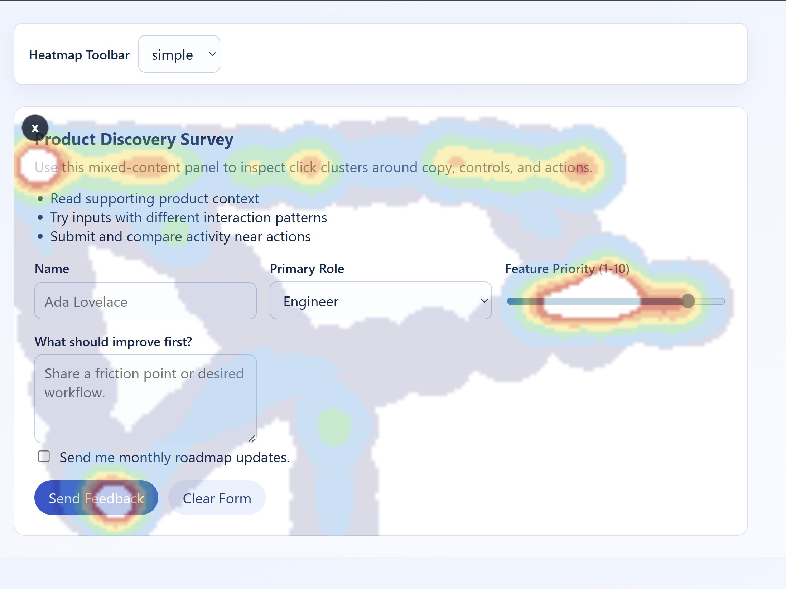

# heatspot

`heatspot` is an ESM TypeScript library for capturing pointer heat data and rendering an embeddable heatmap web component.

## Features

- ESM package output with TypeScript declarations
- Pointer heat tracking utility API
- Reusable `<heat-map>` component with slot-based content
- Built-in toggle icon (top-left) to show heat overlay
- Configurable `toolbar` attribute: `simple` (default) or `hidden`

## Installation

```bash
npm install heatspot
```

## Usage

### 1. Import the library

```ts
import "heatspot";
```

The `heat-map` custom element is registered on import.

### 2. Render the component

```html
<heat-map toolbar="simple">
  <section>
    <h2>Example Panel</h2>
    <p>Move the mouse over this area, then click the icon in the top-left.</p>
  </section>
</heat-map>
```

`toolbar` options:

- `simple` - show the heatmap toggle icon
- `hidden` - hide the heatmap toggle icon

Example with hidden toolbar:

```html
<heat-map toolbar="hidden">
  <section>
    <h2>Passive Tracking Panel</h2>
    <p>The heatmap toggle icon is not rendered in this mode.</p>
  </section>
</heat-map>
```

### Example



### 3. Optional tracking API

```ts
import {
  configureMouseHeatmap,
  getMouseHeatmapData,
  resetMouseHeatmap,
  startMouseTracking,
  stopMouseTracking
} from "heatspot";

configureMouseHeatmap({ mergeRadius: 24, maxHotspots: 450 });
startMouseTracking();

const snapshot = getMouseHeatmapData();
console.log(snapshot.hotspots);

stopMouseTracking();
resetMouseHeatmap();
```

## Scripts

- `npm run build` - compile library to `dist/`
- `npm run test` - run Vitest tests
- `npm run test:coverage` - run tests with coverage reports in `coverage/`
- `npm run build:verify` - run tests and harness build
- `npm run pack:check` - show package contents using `npm pack --dry-run`

## Development

```bash
npm install
npm start
```

## License

MIT
